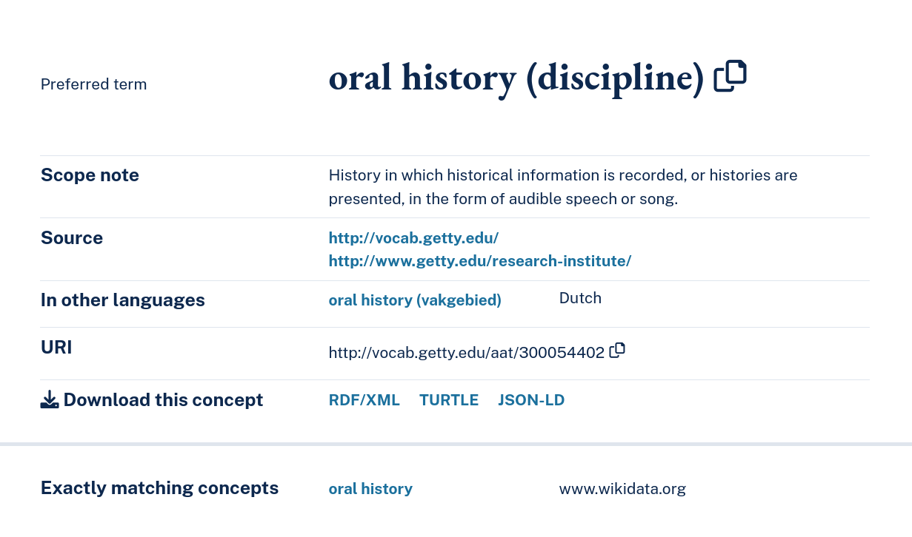

# Getty - Art and Architecture Thesaurus Concepts (AATC) - *an AAT slim* 

## Report
See https://doi.org/10.5281/zenodo.15487726


## AATC - Art and Architecture Thesaurus Concepts - a simplified controlled vocabulary

> [!IMPORTANT]
> The Art and Architecture Thesaurus Concepts (AATC) is a *slim*, or a subsection of Getty AAT concepts. 

**The AATC is a SKOS concept scheme that restructures the concepts from the Art and Architecture Thesaurus (AAT) into a flat controlled vocabulary, and excludes non-concepts, such as facets, hierarchies and guide terms.** 

The result is a controlled vocabulary where each term is a `skos:Concept`, member of `aatc: skos:ConceptScheme` and includes:
* English(@en), and when available Dutch(@nl) labels (`skos:prefLabel`) 
* scope notes (`skos:scopeNote`)
* matching concepts (`skos:exactMatch`), often Wikidata items
* source (`dcterms:source`) 

 
Example turtle (RDF) representation of concept aat:300054402 *oral history (discipline)*:
```
aat:300054402
  a skos:Concept ;
  dc:source <http://www.getty.edu/research-institute/>, <http://vocab.getty.edu/> ;
  skos:exactMatch wd:Q558929 ;
  skos:inScheme aatc:aatconcepts ;
  skos:prefLabel "oral history (vakgebied)"@nl, "oral history (discipline)"@en ;
  skos:scopeNote "History in which historical information is recorded, or histories are presented, in the form of audible speech or song."@en .
```




Deprecated terms are also included, and identified with the statements `owl:deprecated true` and `dc:isReplacedBy aatc:XYZ`. 

Output: [aatc.ttl](aatc.ttl) 

### Motivation 

AATC development was motivated by the need to index AAT terms in a Skosmos server, so that AAT terms could be used easily queried via the Skosmos API and easily used by software applications to classify data with AAT terms.

Since our current use-cases, that called for the us of AAT concepts, were not concerned with parent/child relation between concepts, we have decided to remove the hierarchical relations of AAT. Instead, we focused on creating a flat controlled vocabulary, containing all concepts that included English labels. 

### AATC Creation & Validation

The script **[aatc_generate.py](aatc_generate.py)** performs the generation of the AATC, via a `CONSTRUCT` SPARQL query, that transforms the query result onto a new structure, saved in the RDF based turtle file [aatc.ttl](aatc.ttl) (~8Mb).


* requirements: [SPARQLWrapper](https://sparqlwrapper.readthedocs.io/en/latest/) 

The script **[aatc_validate.py](aatc_validate.py)** only performs the validation of the AATC agains the [aatc_shacl.ttl](aatc_shacl.ttl) SHACL rules. If the validation fails, script will output an AssertionError 
* requirements: [rdflib](https://rdflib.readthedocs.io/en/stable/), [pyshacl](https://github.com/RDFLib/pySHACL)
* also possible to run shape with [Apache Jena's SHACL command](https://jena.apache.org/documentation/shacl/) `shacl v --shapes aatc_shacl.ttl --data aatc.ttl`

## AATC Testing
### Loading into Skosmos
from this directory run:
`.skosmos-load-aatc.sh`

this script will clone Skosmos onto `Skomos/`; append aatc Skosmos configuration to `Skosmos/dockerfiles/config/config-docker-compose.ttl`; create the Skosmos + Fuseki docker containers; load the aatc.ttl onto Fuseki.

If all goes well the AATC will be available at http://localhost:9090/AATC/


- `resources.md`(resources.md) provides a list of the documentation that was consulted in the process of creating the landscape analysis. 
